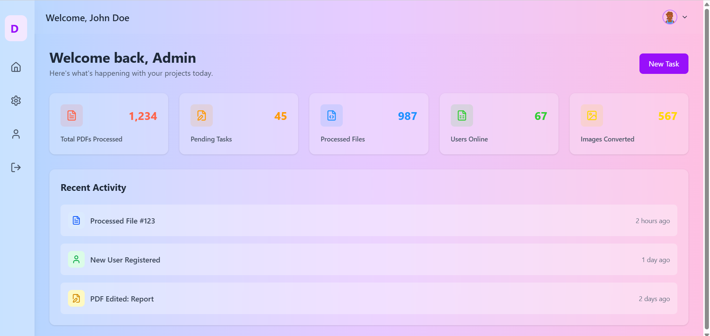

markdown

# FastApi Dashboard




Welcome to the FastApi Dashboard project! This is a modern, responsive web application built using React, TypeScript, and Tailwind CSS. The dashboard provides users with a comprehensive overview of their PDF processing activities, user management, and personal profile settings.

## Features

- **Dashboard Overview**: Get a quick snapshot of your PDF processing activities, including total PDFs processed, pending tasks, users online, and more.
- **User Profile**: View and manage your profile information, including followers, following, and projects.
- **Settings**: Customize your experience with dark mode, email notifications, and push notifications.
- **PDF Tools**: Access a variety of PDF tools such as PDF to Word, PDF to HTML, PDF to PPT, PDF to Excel, and PDF to JPG conversions.

## Technologies Used

- **React**: A JavaScript library for building user interfaces.
- **TypeScript**: A typed superset of JavaScript that improves the development experience.
- **Tailwind CSS**: A utility-first CSS framework for rapidly building custom designs.

## Getting Started

### Prerequisites

- Node.js and npm installed on your machine.

### Installation

1. Clone the repository:
   ```
   git clone https://github.com/NhoThoang/react_typescript_tailwind.git
Navigate to the project directory:


cd FastApi-dashboard
Install dependencies:


npm install
Start the development server:


npm start
Open your browser and visit http://localhost:4000 to view the application.

Project Structure
src/components/: Contains reusable React components.

src/pages/: Contains the main pages of the application.

src/styles/: Contains Tailwind CSS configuration and custom styles.

src/utils/: Contains utility functions and helpers.

Contributing
Contributions are welcome! Please fork the repository and create a pull request with your changes.

License
This project is licensed under the MIT License. See the LICENSE file for more details.

Acknowledgments
Thanks to the React, TypeScript, and Tailwind CSS communities for their excellent documentation and support.

Enjoy using FastApi Dashboard! If you have any questions or feedback, please feel free to open an issue or contact the maintainers.


This `README.md` provides a comprehensive overview of the project, including features, technologies used, installation instructions, project structure, and contribution guidelines. It is designed to be informative and visually appealing, making it easy for new contributors to get started.
